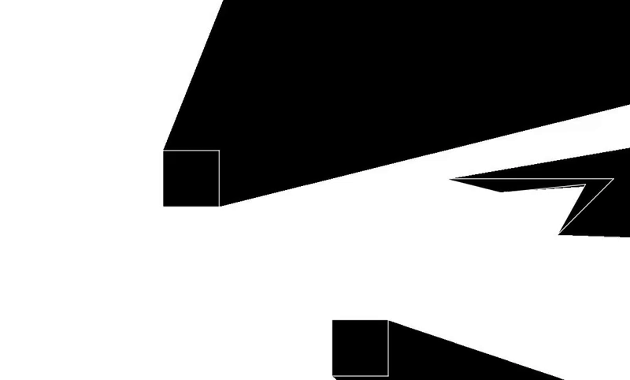

# Raytracer2DDemo
A demo that simulates a light source in 2D using linear algebra and the LÖVE game engine.

# Requirements
I created this project years ago, but I can confirm that it works with LÖVE version 11.2, which is available for free at https://love2d.org/
